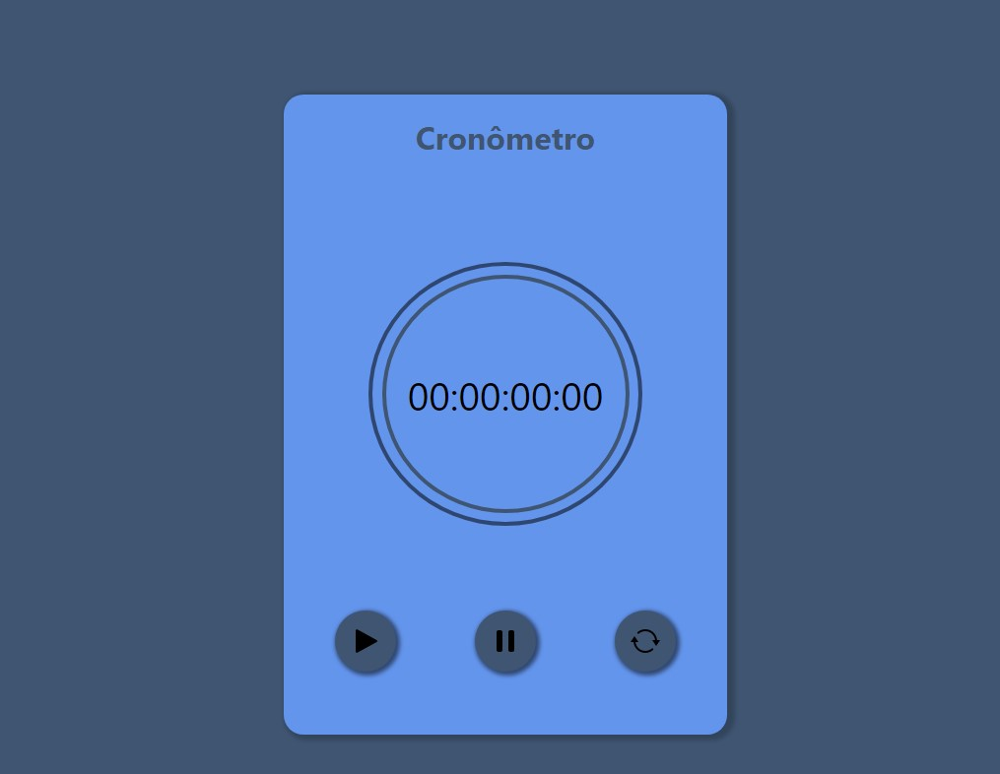

# ⏱ Cronômetro 

💡  Aplicação criada para aplicar conceitos básicos.

 ##  🛠 Tecnologias 
- HTML
- CSS
- JavaScript 
- React

---

[🔗 clique aqui!](https://cronometro-react-eight.vercel.app/) e Confira a aplicação no ar

## ✏️ Considerações

Apesar de simples pude consolidar conceitos básicos e ter a experiência de construir algo do zero! Um grande avanço pra quem nunca teve contato com programação!

---

✅ Comemore os pequenos Começos
